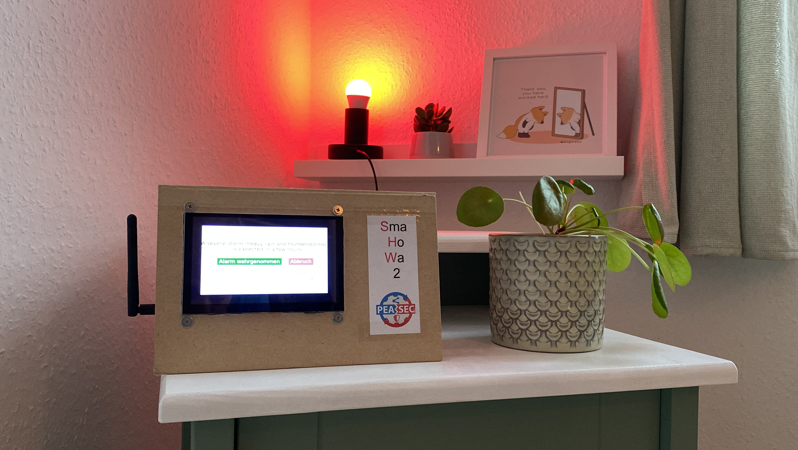
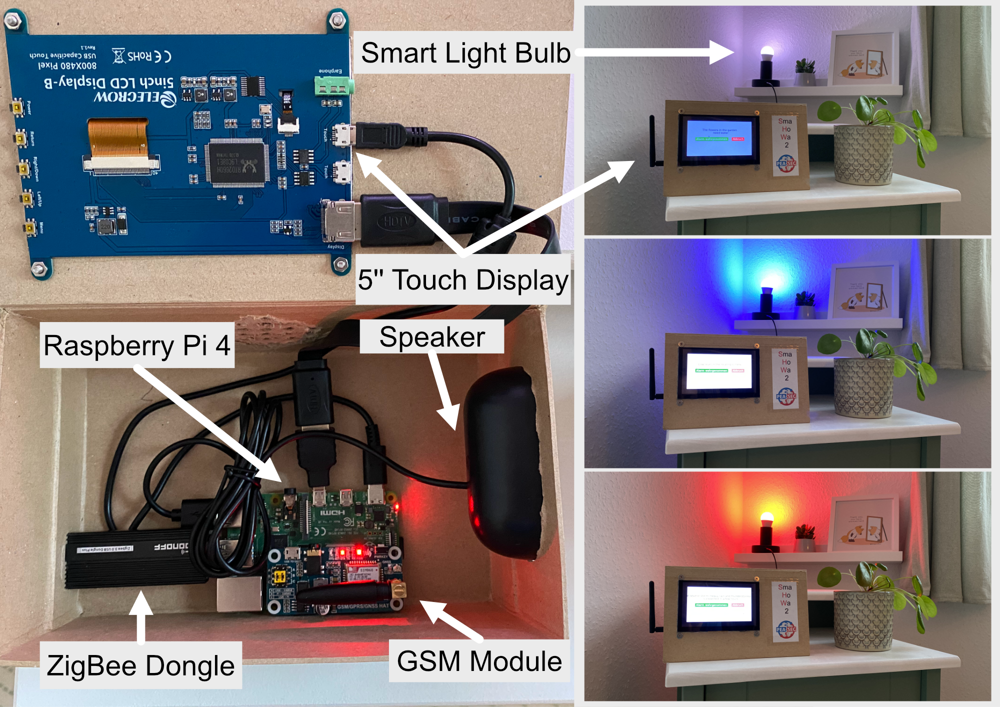
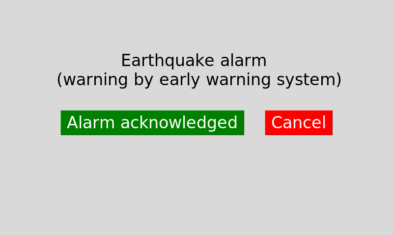
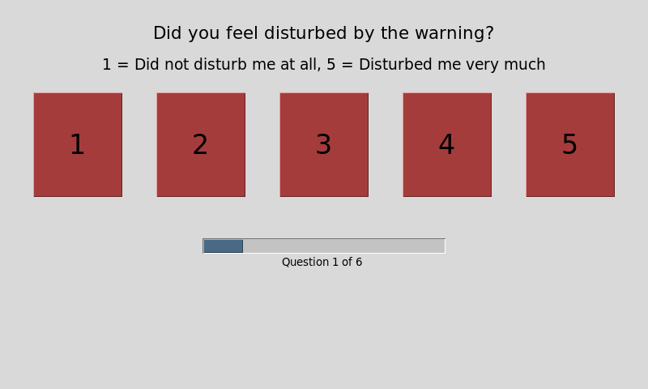

# Smart Home Warning System Prototype for user studies

## Background
The code provided in this repository represents the software for the prototype of the Smart Home Warning System described in the Paper **"Getting the Residents' Attention: The Perception of Warning Channels in Smart Home Warning Systems."** currently in preparation.
Abstract:
>About half a billion households are expected to use smart home systems by 2025. Although many IoT sensors, such as smoke detectors or security cameras, are available and governmental crisis warning systems are in place, little is known about how to warn appropriately in smart home environments. We created a Raspberry Pi based prototype with a speaker, a display, and a connected smart light bulb. Together with a focus group, we developed a taxonomy for warning messages in smart home environments, dividing them into five classes with different stimuli. We evaluated the taxonomy using the Experience Sampling Method (ESM) in a field study at participants' (N = 13) homes testing 331 warnings. The results show that taxonomy-based warning stimuli are perceived to be appropriate and participants could imagine using such a warning system. We propose a deeper integration of warning capabilities into smart home environments to enhance the safety of citizens.

The Public URL to the paper will be provided upon final acceptance.

##

## Hardware of the prototype:

The prototype runs on a Raspberry Pi 4 using Raspberry Pi OS, a debian-based operating system. Several components are connected to the Pi:
- 5-inch touch display with a resolution of 800x480
- USB speaker
- GSM hat
- ZigBee 3.0 USB dongle

## Autostart
To ensure the code runs as soon as the Raspberry Pi boots, the main_dialog.py file needs to be added to the autostart. This can be done by executing the following steps:
1. Open the terminal and create a .desktop file in the autostart directory
2. Add the following line to the .desktop file:  `[Desktop Entry] python3.9 /home/pi/shws/main_dialog.py`
3. Save the file and reboot the Pi afterwardsf

## Warnings

The warnings presented can be configured in resources/simulations/TestSimulation.json

## ESM ratings

After each alarm, participants can give immediate feedback. The ESM questions can be configured in questions.json.

## Files
The log files created by the application can be found at /home/pi/shws/resources/log.log. The evaluation of the user is stored at /home/pi/shws/resources/feedback. The paths can be configured by changing the corresponding variables in the class util.py.

## Contact
https://peasec.de/team/haesler/
